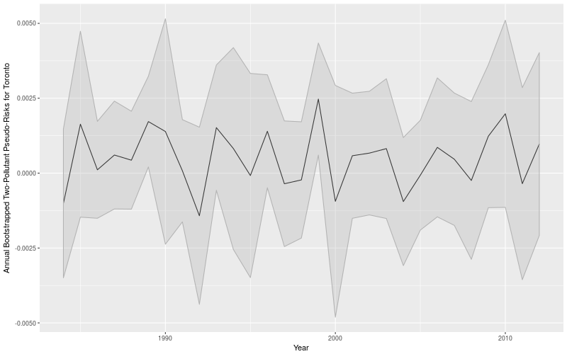
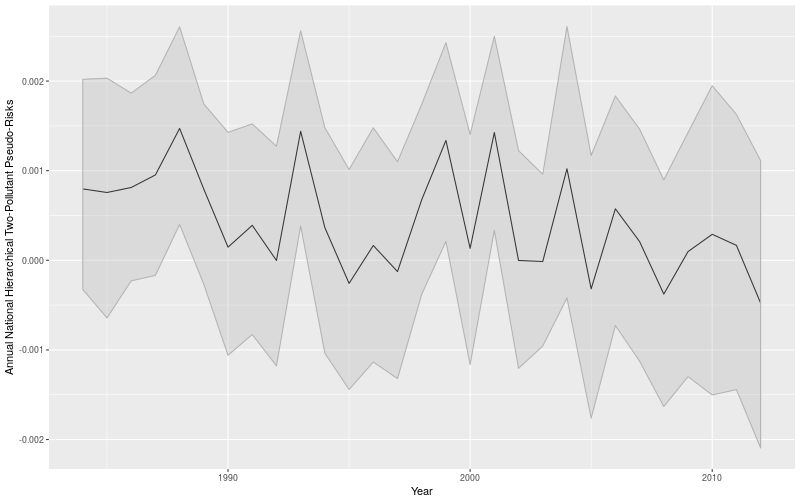
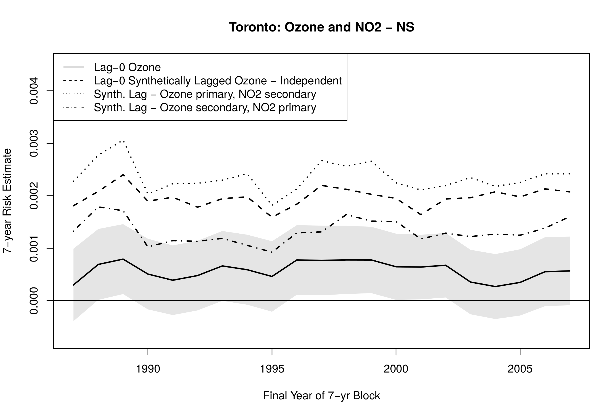
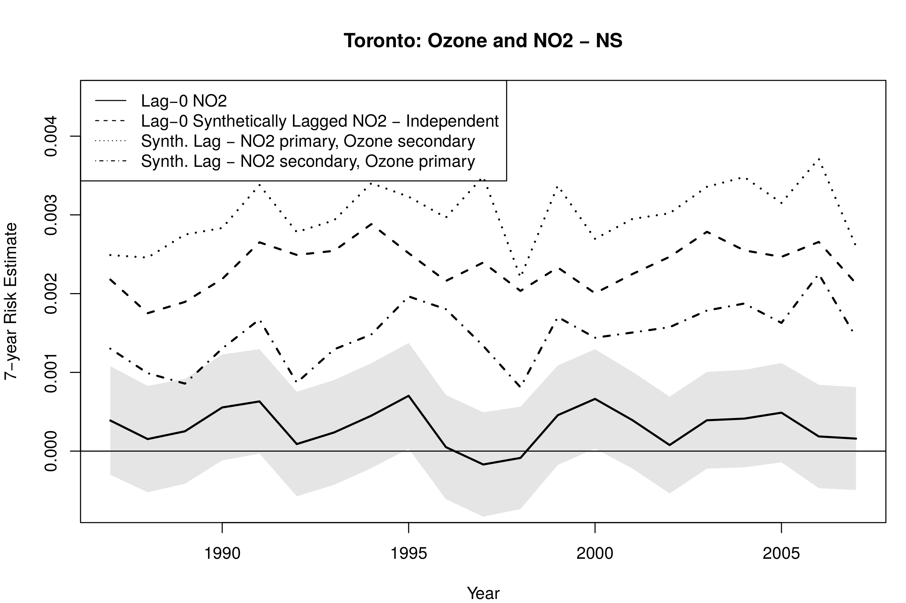

class: inverse

```{r include=FALSE}
library(ggplot2)
filter <- dplyr::filter
knitr::opts_chunk$set(warning=FALSE, message=FALSE, fig.width=10.5, fig.height=4, 
  comment=NA, rows.print=16)
theme_set(theme_gray(base_size = 24))
```


## Multiple Pollutant Models

**Problem**: Exposure assessment is challenging because "air pollution" is a complex mixture, not a static construct

<br />
* historical models have either used single pollutants, or handwaved vigorously at the inclusion of multiple pollutants
* obvious dependencies among pollutants, up to and including significant correlations and coherences
* topic of active research among a number of research groups (e.g., HEI-funded projects in the USA, LSH&TM, etc.)

---

class: inverse

## Approach #1: Geometric

**Genesis**: 

<br />
* air pollutants are correlated
* the correlated structure interferes with the linearity of the model framework and estimation
* why not try to leverage the correlation?

---

class: inverse

## Sketch of Algorithm

<span style="font-size: 10px;">
* begin by estimating two acute risk models, one for each pollutant, accounting for the usual confounding variables, obtaining risks $\phi_{01}$ and $\phi_{02}$
* estimate correlation (angle) between 1st and 2nd pollutant, $\phi_{12}$ 

Then ... in $\mathbb{R}^3$:

* set pollutant risk vector $\vec{x}_1 = \vec{i} + \tan(\phi_{01})\vec{z}$
* set pollutant risk vector $\vec{x}_2 = \cos(\phi_{12})\vec{i} +$ <br> $\sin(\phi_{12})\vec{j} + \tan(\phi_{02})\vec{z}$
</span>
---

class: inverse

## Functionally ...

This approach is just treating time series realizations as vectors 

<br/>
* overall covariances interpreted as inner products, giving the structural issue  consideration as a rotational angle
* magnitudes of individual models taken as vector magnitudes

<br />

So how do we extract a singular representative of risk?

---

class: inverse

## Aggregating

This approach gives a planar surface in $\mathbb{R}^3$ for each pair of pollutants, and standardized model.

<br />

**Options**:
<br/>
* standardize a direction, take slope of line in plane in that direction
* bisect the two pollutants
* choose a direction based on a secondary weighting scheme?

---

class: center

## Results: Toronto, Ontario - 1984-2012 (NO2 and O3)


  
---

class: center

## Results: National Risks (Canada) - 1984-2012 (NO2 and O3)



---

class: inverse

## Comments

This is very much still a work-in-progress.

<br />

* How to interpret the combined risk: an increase of N units of combined concentration?
* "User degrees-of-freedom": distinct choice of aggregate extraction
* Crazy idea?

---

class: inverse

## Synthetic Lag

Recent development of a univariate distributed lag-like methodology for estimation of risk called *synthetic lag* naturally extends to multiple pollutants.

<br />

* Identify coherent (frequency domain analogue of correlated) frequency bands
* Phase align those bands of the *pollutant* individually with the phases of the *health effect*
* Equivalent to decomposing pollutant series and lagging individual series

<br>
Burr, Shin and Takahara (2018) **Synthetically lagged models**. *Statistics & Probability Letters*. DOI:10.1016/j.spl.2018.07.008
---

class: inverse

## Extending Synthetic Lag

* Methodology naturally extends to arbitrary series
* Identify bands from pollutant + health effect series, but then ...
    - use the **pollutants** as inputs
    - de-correlate pollutants by selectively aligning or masking bands, respectively

<br />

* requires user choice of "primary" and "secondary" pollutants
* allows traditional naive multiple pollutant models (e.g., GAM with two pollutant series)
* interpretation remains complex

---

class: inverse

## Interpretation?

So how might we interpret this approach?

<br />

* primary pollutant can be interpreted as traditionally (albeit with the phase alignment; so in a distributed lag sense)
* secondary pollutant - "after accounting for"?

---

class: center

## Results: Toronto, Ontario - 1984-2012 (Ozone)


  
---

class: center

## Results: Toronto, Ontario - 1984-2012 (NO2)



---


layout: false
class: inverse 

## Future Work

<br>

* methodologically, both approaches "work"
* interpretation remains complicated!
* better, worse, comparison to other current work?
* common components - worth extracting? (other talks in this session)

---

layout: false
class: inverse, middle

<center>
<a href="http://www.trentu.ca/math/"></a> &emsp;&emsp;
<a href="http://mast.queensu.ca/"></a> &emsp;&emsp;
<a href="https://creativecommons.org/licenses/by/4.0/"></a>
</center>

## If you're interested, let me know - I'd love to talk more about our work.

- Contact me: [Email](mailto:wesleyburr@trentu.ca) or [Twitter](https://twitter.com/wsburr)
- Slides created via the R package [xaringan](https://github.com/yihui/xaringan) by Yihui Xie
- Slides at <http://bit.ly/isesisee18>

<br/>

This research was partially funded under a CESI/CARA grant via the EHSRB of Health Canada.
